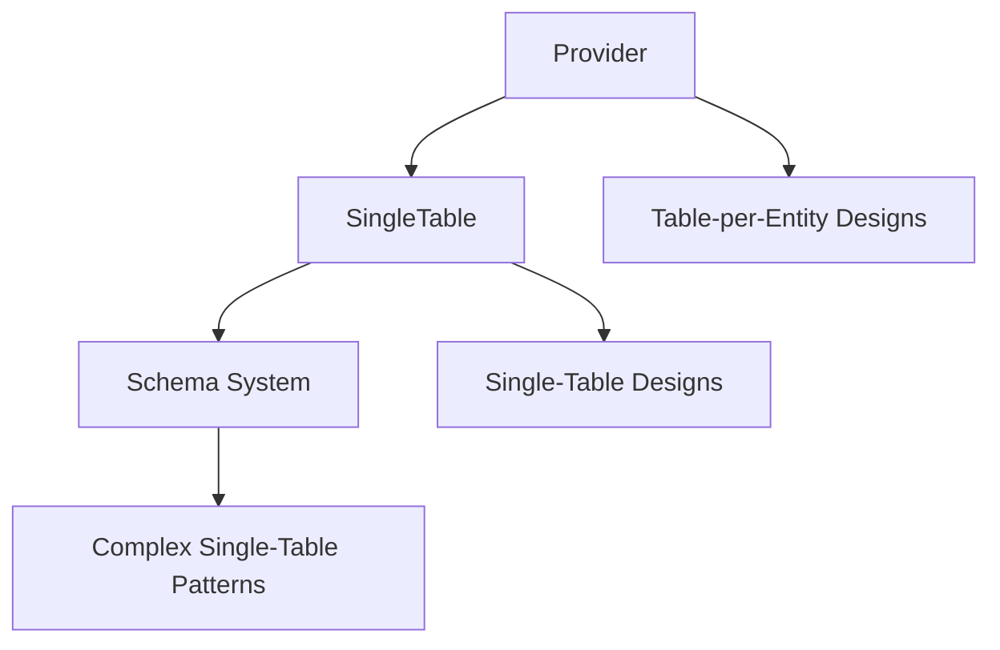

# Architecture

The library has three parts that build on each other. Use only what you need—the provider works standalone, and SingleTable works without schemas.

## The Three Layers

### 1. DynamoDB Provider

**What it is**: Type-safe wrappers around DynamoDB operations (get, update, query, transaction, etc.)

**When to use**: Table-per-entity designs where each entity type has its own table

**Key features**:
- Full TypeScript support for all operations
- Simplified expression building
- Automatic attribute name handling
- Works with both AWS SDK v2 and v3

**Example use case**: You have separate tables like `Users`, `Products`, `Orders` and want type-safe operations on each.

[Learn more about Provider →](/provider/)

### 2. SingleTable

**What it is**: Table configuration layer that removes repetition when all operations target the same table with fixed keys and indexes

**When to use**: Single-table designs where multiple entity types share one DynamoDB table

**Key features**:
- Centralized table configuration
- Automatic key management (partition key, sort key, indexes)
- Type property for entity identification
- Property cleanup (removes internal keys from results)
- TTL management

**Example use case**: You store Users, Orders, Products, and Reviews all in one table called `AppData` with `PK` and `SK` columns.

[Learn more about SingleTable →](/single-table/)

### 3. Schema System

**What it is**: Entity and collection definitions for single-table designs, with partition and access pattern management

**When to use**: Complex single-table designs requiring sophisticated data modeling

**Key features**:
- Entity definitions with type-safe key generators
- Partition management for related entities
- Collection joins for retrieving related data
- Auto-generation of properties (IDs, timestamps, etc.)
- Type-safe access patterns

**Example use case**: You have complex relationships like User → Profile → Permissions → AuditLogs and want to query and join them efficiently.

[Learn more about Schema →](/schema/)

## How They Work Together



Each layer builds on the previous:

1. **Provider** is the foundation - it works with any table design
2. **SingleTable** uses the Provider but adds table-specific configuration
3. **Schema** uses SingleTable but adds entity modeling and relationships

## Choosing the Right Layer

### Use Provider when:
- You have table-per-entity design
- You want minimal abstraction over DynamoDB
- Each entity type has its own table
- You don't need entity modeling features

### Use SingleTable when:
- You use single-table design
- Multiple entity types share one table
- You want automatic key and property management
- You don't need complex entity relationships

### Use Schema when:
- You use single-table design
- You have complex access patterns
- You need entity relationships and collections
- You want auto-generated properties
- You need partition-based data modeling

## Example Progression

### Level 1: Provider (Table-per-Entity)

```typescript
const provider = new DynamodbProvider({ /* config */ });

// Direct table operations
await provider.create({
  table: 'Users',
  item: { userId: '123', name: 'John' }
});

await provider.create({
  table: 'Orders',
  item: { orderId: '456', userId: '123', total: 100 }
});
```

### Level 2: SingleTable

```typescript
const table = new SingleTable({
  dynamodbProvider: provider,
  table: 'AppData',
  partitionKey: 'pk',
  rangeKey: 'sk'
});

// Simplified operations with automatic key management
await table.create({
  key: { partitionKey: 'USER#123', rangeKey: '#DATA' },
  item: { userId: '123', name: 'John' },
  type: 'USER'
});

await table.create({
  key: { partitionKey: 'USER#123', rangeKey: 'ORDER#456' },
  item: { orderId: '456', total: 100 },
  type: 'ORDER'
});
```

### Level 3: Schema

```typescript
const User = table.schema.createEntity<UserType>().as({
  type: 'USER',
  getPartitionKey: ({ id }) => ['USER', id],
  getRangeKey: () => '#DATA'
});

const Order = table.schema.createEntity<OrderType>().as({
  type: 'ORDER',
  getPartitionKey: ({ userId }) => ['USER', userId],
  getRangeKey: ({ orderId }) => ['ORDER', orderId]
});

// Type-safe operations with automatic key generation
await table.schema.from(User).create({
  id: '123',
  name: 'John'
});

await table.schema.from(Order).create({
  userId: '123',
  orderId: '456',
  total: 100
});

// Collection joins
const userWithOrders = await table.schema.from(collection).get({
  userId: '123'
});
// Returns: { id: '123', name: 'John', orders: [...] }
```

## Next Steps

Choose the right layer for your use case:

- [Provider Setup](/provider/setup) - For table-per-entity designs
- [SingleTable Configuration](/single-table/configuration) - For single-table designs
- [Schema Entities](/schema/entities) - For advanced single-table modeling
